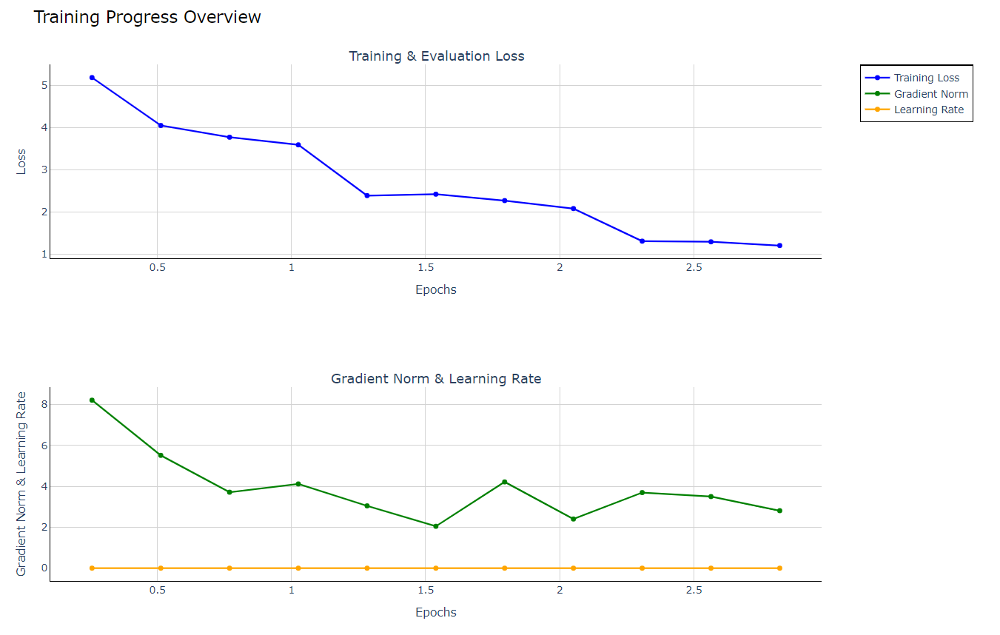

# Training Causal Language Models (LLMs) with Transformers and Accelerate

This repository offers a streamlined approach to fine-tune causal language models (LLMs) using the `hfconfig.yml` file. It's built on top of Hugging Face's Transformers, Torch, and Accelerate modules to facilitate easy and efficient model training.

## Getting Started

### Clone the Repository

```bash
git clone https://github.com/generalaimodels/hffinetuning.git
cd hffinetuning
```

### Install Required Dependencies

Make sure you have the necessary dependencies installed. You can install them via `pip`:

```bash
pip install -r requirements.txt
```

### Usage

To train a model, execute the following command:

```bash
python hf_finetuning/causal_language_model.py hfconfig.yml
```

### Visualizing Training

Once the training is complete, you can visualize the trainer's state using the following command:

```bash
python hf_finetuning/visualize.py ./outputs/trainer_state.json
```

## Configuring the Model

The training process is configured via the `hfconfig.yml` file. This file controls key aspects of the model training process, including:

- **Model specifications**: Define the model architecture and tokenizer paths.
- **Data settings**: Specify the dataset paths, input and target columns, and preprocessing details.
- **Training parameters**: Set the number of epochs, batch size, learning rate, and hardware utilization (like GPUs and mixed precision).
- **Output configurations**: Control where checkpoints, logs, and other outputs are stored.

Here's a breakdown of the core configurations:

### Model Configuration

```yaml
ModelArguments:
  model_name_or_path: "Path to the pretrained model or Hugging Face model"
  tokenizer_name: "Path to the tokenizer or Hugging Face model"
  cache_dir: "Optional cache directory"
  model_revision: "main"
  use_fast_tokenizer: true
  torch_dtype: "auto"
  low_cpu_mem_usage: true
  trust_remote_code: false
```

### Data Settings

```yaml
DataTrainingArguments:
  dataset_name: "Dataset name (e.g., fka/awesome-chatgpt-prompts)"
  dataset_config_name: null
  input_column_names: ["act"]  # Define input columns
  target_column_name: "prompt"  # Define target column
  block_size: 128
  overwrite_cache: false
  preprocessing_num_workers: 1
  validation_split_percentage: 10
  streaming: false
  max_length: 512
```

### Training Parameters

```yaml
TrainingArguments:
  output_dir: "./outputs"
  overwrite_output_dir: true
  num_train_epochs: 3
  per_device_train_batch_size: 16
  per_device_eval_batch_size: 16
  learning_rate: 0.001
  logging_dir: "./logs"
  do_train: true
  do_eval: true
  logging_steps: 10
  save_steps: 100
  save_total_limit: 2
  fp16: true
  seed: 42
```

## Example Command

```bash
python causal_language_model.py hfconfig.yml
```

## Visualizing Training Progress

After fine-tuning is completed, the training state is saved to `trainer_state.json`. To visualize the training:

```bash
python visualize.py ./outputs/trainer_state.json
```

## Overview

The pipeline enables easy fine-tuning of causal language models with minimal configuration. Below is a high-level visual representation of the training process:



## License

This project is licensed under the MIT License.
```

This version highlights key elements of the repository, provides installation steps, and emphasizes how to modify the `hfconfig.yml` file for customization.